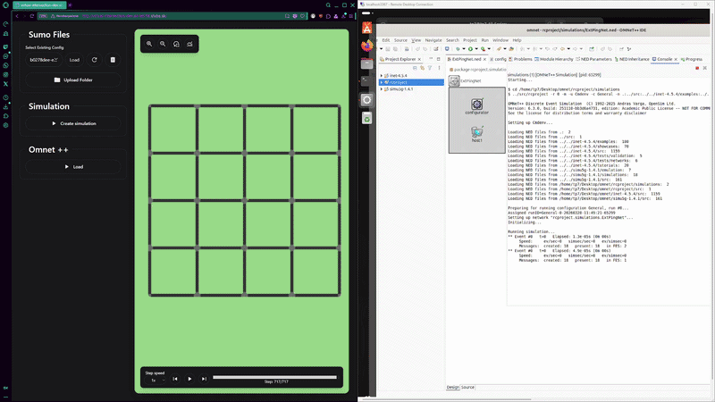
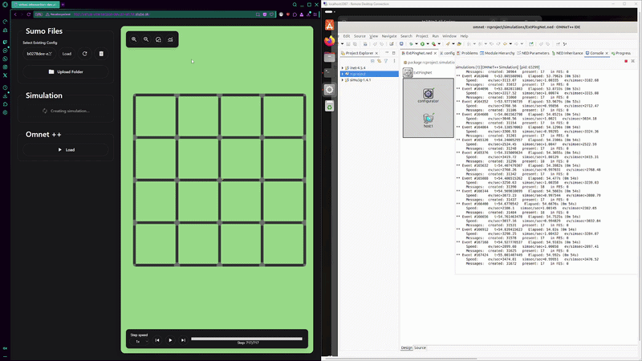
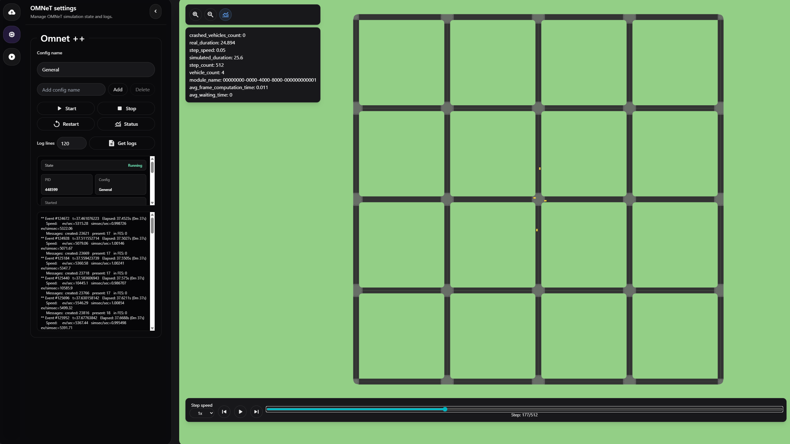
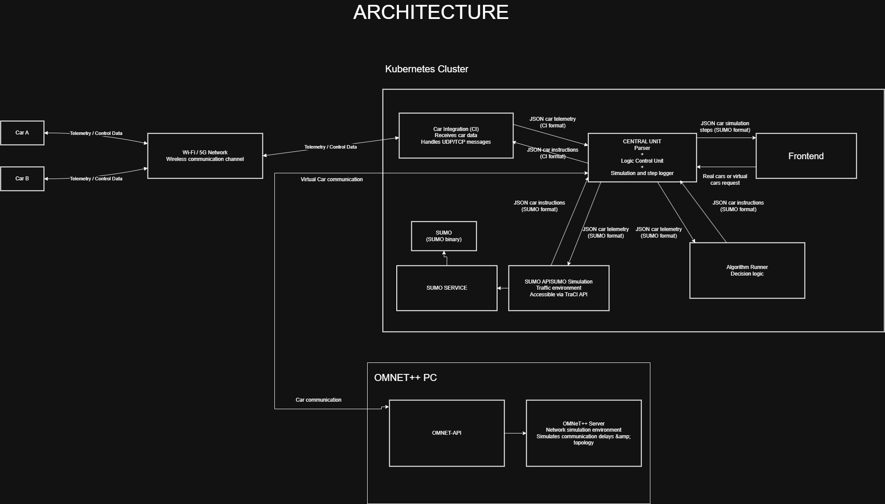
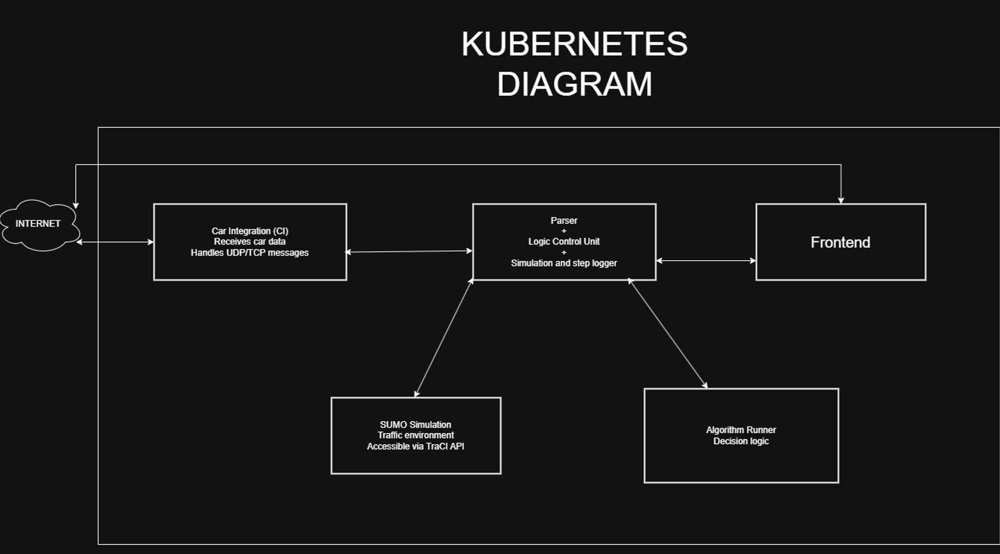
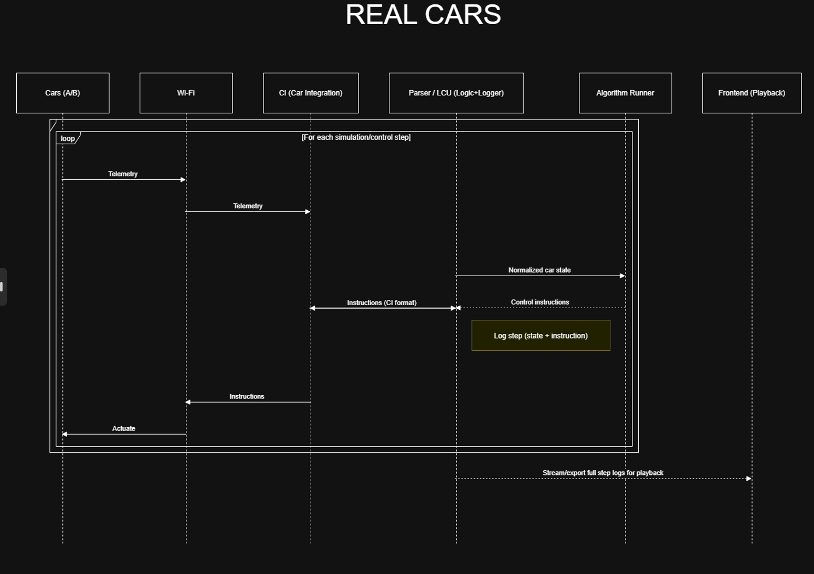
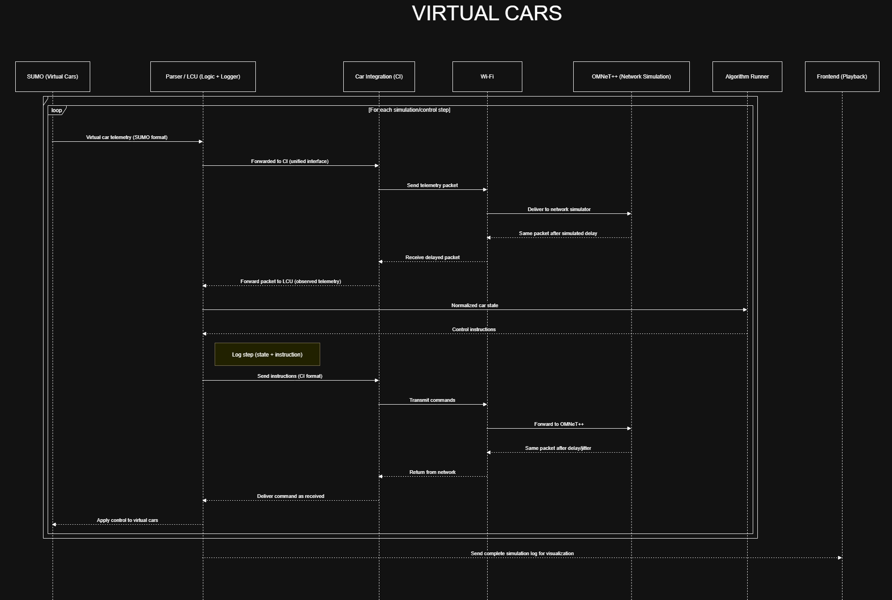

# Onboarding
Information about the project and how it works.

**NOTE:** Main focus of TP2025/26 was to make a starting point for the project, set the ground work and prepare the simulation side of the project. Real cars are not implemented. The missing pice mainly is the car integration module, which is intended to be a bridge for communicating with real-world cars. The communication also needs updating to support real-world cars, but the current communication is designed in a way that it can be easily extended to support both real and virtual cars. (you will need to implement a change for central unit to take routing for real cars and adjust frontend accordingly)

# Showcase of the project
1. Simulation start


2. Simulation end


Whole simulation demo is in this repository file as **demo-video/SIMULATION_DEMO.mp4**

# All accesses and who you need to talk to
**JUMP & KUBERNETES CLUSTER**
- You will need to get jump server and Kubernetes access from **Ing. Matej Janeba Phd.** or any other person resposible for it

**OMNET SERVER**
- For passwords for the server and RDP connection contact the supervisor or responsible maintainer

**GITHUB**
- For access to the repositories, you need to ask for an invite to the organization and repositories

**GITHUB API TOKEN**
- You will need to generate a personal access token for the GITHUB API
- This token is used for:
    1. GHCR access for pulling and pushing images in the cluster

After this you should have access to all the necessary resources to work on the project. If you have any issues with access, please contact the supervisor or the responsible person for the specific resource.

## Deployment Environments

The project uses two Kubernetes environments:

### Development Environment
- **Namespace:** `virtual-intersection-dev`
- **URL:** `https://virtual-intersection-dev.ail-lab.fiit.stuba.sk`
- **Auto-deployment:** Enabled
  - Pushing to the `mqin` branch automatically triggers CI/CD pipeline
  - Images are built, pushed to GHCR, and deployed to the cluster
  - No manual intervention needed for dev deployments
- **Purpose:** Testing, development, and experimentation

### Production Environment
- **Namespace:** `virtual-intersection-prod`
- **URL:** `https://virtual-intersection.ail-lab.fiit.stuba.sk` (or similar)
- **Deployment:** Manual only
  - Requires explicit deployment commands
  - Used for stable, tested releases
  - Always test thoroughly in dev before deploying to prod
- **Deployment process:**
  1. Test changes in dev environment
  2. Merge approved changes to main/production branch
  3. Connect to cluster via jump server
  4. Apply manifests to production namespace
  5. Verify deployment status

For detailed deployment instructions, see the [Kubernetes README](../Kubernetes/README.md).

## Modules

- **SUMO + SUMO service + SUMO API** --> SUMO simulates traffic, the SUMO service container runs the simulator, and SUMO API exposes HTTP endpoints and TraCI control.
- **Frontend** --> Svelte UI for uploading configs and viewing simulation state
- **Alg-runner** --> computes driving instructions from simulation state
- **car integration** --> bridge for communicating with real-world cars
- **OMNET** --> network simulator used when the OMNeT path is enabled through the central unit
- **OMNET API** --> manages OMNeT simulation lifecycle on the host
- **Central unit** --> orchestrates requests between the simulation, algorithm, and network services

Every repository has its own README file with more detailed information about the specific module, how to run it, and how it works. It is recommended to read through the README files of each module to get a better understanding of the project as a whole.



Frontend interface

## Information repos

- Onboarding
- T7 website
- .github

## Architecture


- Adjustments:
    - OMNeT API (placed before OMMNET - Serves as API controller for OMNET simulations)
    - SUMO API+SUMO was split into for better developmnet and SUMO Service was added to interact with SUMO binary and run the simulation 

## Kubernetes Architecture
This represents a concept for how Kubernetes should be set up. 



## How does it all work (workflow)

Workflow is split into two parts:
- Real cars (rc cars)
- Virtual cars (cars simulated via sumo)

### Real cars (not implemented yet)
This module/workflow represents communication and instructions for real-world RC cars. Real cars communicate through *car-integration->LCU* to *Alg runner*. Alg runner sends directions and instructions, and real-world cars send telemetry data and receive instructions.



### Virtual cars
This module/workflow represents communication and instructions for virtual cars. This is intended for "offline testing" purposes. Cars are simulated via SUMO, instructions are sent via ALG runner, and OMNET is used for network simulation.

***NOTE*** - communication is going through OMNET and not directly through **SUMO->Alg** runner to simulate real communication.



## Detailed System Workflow

The following steps describe the current lifecycle of a virtual-car simulation in the project. The system is composed of several cooperating services: **Frontend**, **Central Unit**, **Algorithm Runner**, **OMNeT API**, **OMNeT++**, **SUMO API**, **SUMO Service**, and **SUMO**.

The main idea is that **SUMO** produces the vehicle simulation, **OMNeT++** simulates the network behavior between messages, **Algorithm Runner** computes control decisions, and the **Central Unit** coordinates the whole data flow and stores the information required for later playback.

---

### 1. Deployment and Service Initialization

The system is deployed via Docker Compose or Kubernetes. After deployment, the individual services are running and waiting for commands.

- **Frontend** provides the user interface for configuring, starting, monitoring, and replaying simulations.
- **Central Unit** acts as the main coordinator between the simulation, networking layer, algorithm execution, and logging.
- **Algorithm Runner** waits for setup information and later computes control instructions for vehicles.
- **OMNeT API** manages the lifecycle of the OMNeT++ simulation, such as start, stop, restart, status checks, and log access.
- **OMNeT++** represents the network simulation layer.
- **SUMO API** communicates with the rest of the system and interacts with the running SUMO simulation.
- **SUMO Service** is responsible for calling and managing the SUMO binary.
- **SUMO** performs the traffic simulation itself.

At this stage, the services exist, but the simulation has not yet started.

---

### 2. Configuration and Algorithm Setup

The simulation setup begins from the **Frontend**.

The setup flow is:

1. The user configures the simulation in the **Frontend**.
2. The **Frontend** sends a setup request to the **Central Unit**.
3. The **Central Unit** forwards the setup information to the **Algorithm Runner**.
4. The **Algorithm Runner** prepares the selected algorithm and stores the information required for decision-making.

This setup information may include the selected algorithm, simulation parameters, vehicle-related configuration, and map or scenario information needed by the algorithm.

The purpose of this phase is to prepare the **Algorithm Runner** before live vehicle messages start arriving from the simulation.

---

### 3. Starting the OMNeT++ Simulation

After the setup phase, the user starts the OMNeT++ network simulation.

The OMNeT++ start flow is:

1. The user triggers the OMNeT++ start action from the **Frontend**.
2. The request is sent to the **OMNeT API**.
3. The **OMNeT API** starts the OMNeT++ simulation.
4. The **OMNeT API** provides status and logs for the OMNeT++ simulation.

The **OMNeT API** is therefore mainly a lifecycle and management interface around OMNeT++. It handles operations such as:

- start,
- stop,
- restart,
- status,
- logs.

The actual network simulation behavior is handled by **OMNeT++**.

---

### 4. Starting the SUMO Simulation

After OMNeT++ is started, the user starts the SUMO traffic simulation from the **Frontend**.

The SUMO start flow is:

1. The user starts the SUMO simulation in the **Frontend**.
2. The **Frontend** sends the request to the **Central Unit**.
3. The **Central Unit** forwards the request to the **SUMO API**.
4. The **SUMO API** calls the **SUMO Service**.
5. The **SUMO Service** starts the SUMO binary.
6. **SUMO** begins the traffic simulation.
7. The **SUMO API** then interacts with the running SUMO simulation and sends simulation data further into the system.

This split is important:

- **SUMO Service** handles the SUMO process/binary.
- **SUMO API** interacts with the running simulation and exposes the simulation state to the rest of the system.

---

### 5. Main Simulation Loop

Once SUMO and OMNeT++ are running, the system enters the main simulation loop. The loop continues until the simulation is finished.

The simulation works in repeated steps. In each step, vehicle data is sent through the system as individual car messages.

---

#### 5.1 SUMO Produces Vehicle Messages

During each simulation step, **SUMO** produces the current state of the simulated vehicles.

The data flow is:

1. **SUMO** runs the current simulation step.
2. **SUMO Service** manages the running SUMO process.
3. **SUMO API** receives or extracts the simulation state.
4. **SUMO API** sends vehicle messages to the **Central Unit**.

Each car is handled as a separate message. This means that instead of forwarding one large global simulation object, the system processes vehicle data individually.

A vehicle message may represent data such as:

- vehicle ID,
- position,
- speed,
- lane,
- route,
- current state in the simulation.

---

#### 5.2 Vehicle Messages Pass Through OMNeT++

After the **Central Unit** receives vehicle messages from the SUMO side, the messages are sent through the network simulation.

The flow is:

1. **Central Unit** receives vehicle messages from **SUMO API**.
2. **Central Unit** sends the messages to **OMNeT++**.
3. **OMNeT++** applies the configured network simulation behavior.
4. **OMNeT++** sends the resulting messages back to the **Central Unit**.

This step represents the communication path from the simulated vehicles toward the central control system.

Depending on the OMNeT++ configuration, the message may be affected by simulated network behavior such as delay, jitter, or loss. The exact behavior depends on the used OMNeT++ model and configuration.

---

#### 5.3 Central Unit Sends Processed State to Algorithm Runner

After the vehicle messages return from OMNeT++, the **Central Unit** forwards the processed vehicle state to the **Algorithm Runner**.

The flow is:

1. **Central Unit** receives the messages returned from **OMNeT++**.
2. **Central Unit** forwards the relevant state to the **Algorithm Runner**.
3. **Algorithm Runner** processes the current simulation state.
4. **Algorithm Runner** computes control instructions.

The **Algorithm Runner** is responsible for deciding what should happen next in the simulation. Depending on the selected algorithm, it may produce instructions such as stopping a vehicle, changing speed, changing priority, or allowing a vehicle to continue.

---

#### 5.4 Algorithm Instructions Pass Through OMNeT++

The instructions produced by the **Algorithm Runner** are sent back through the system.

The flow is:

1. **Algorithm Runner** sends control instructions to the **Central Unit**.
2. **Central Unit** sends the instructions through **OMNeT++**.
3. **OMNeT++** applies the configured network simulation behavior to the instruction messages.
4. **OMNeT++** sends the resulting instruction messages back to the **Central Unit**.

This represents the communication path from the central decision-making system back toward the simulated vehicles.

---

#### 5.5 Instructions Are Applied Back to SUMO

After the instruction messages return from OMNeT++, the **Central Unit** forwards them back to the SUMO side.

The flow is:

1. **Central Unit** receives the instruction messages from **OMNeT++**.
2. **Central Unit** forwards the instructions to **SUMO API**.
3. **SUMO API** sends the relevant commands to **SUMO Service** or applies them to the running SUMO simulation.
4. **SUMO** applies the instructions to the vehicles.
5. The next simulation step begins.

The main loop can therefore be summarized as:

```text
SUMO
→ SUMO Service
→ SUMO API
→ Central Unit
→ OMNeT++
→ Central Unit
→ Algorithm Runner
→ Central Unit
→ OMNeT++
→ Central Unit
→ SUMO API
→ SUMO Service
→ SUMO
```

## Local Development with Docker Compose

**NOTE**: The current version does not support local development since it requiers OMNET. Since autodeploy is enable. Testing is done on development branch of kubernetes cluster.

To test the system locally, you can use the provided `docker-compose.yaml`.

### 1. Download Required Components
Clone/Download the following repositories into a single root directory:
- `alg-runner`
- `central-unit`
- `frontend`
- `sumo-service` (Note: This must be renamed or cloned into a folder named `sumo` to match the docker-compose configuration)
- `sumo-api`
- `frontend`
- `docker-compose.yaml`

### 2. Prepare Docker Compose
Copy the `docker-compose.yaml` file from the `Onboarding` directory to the root directory (where all the component folders are located).

The directory structure should look like this:

```text
/root
|-- alg-runner/
|-- central-unit/
|-- frontend/
|-- Onboarding/
|-- sumo/
|-- sumo-api/
`-- docker-compose.yaml
```

### 3. Run the System
From the root directory, run:

```bash
docker compose up --build
```
This will build and start all services locally. Wait for the services to become healthy before interacting with the system. The current compose file points OMNeT-related traffic to an external host, so that path only works when the host is reachable.

The exposed ports in the current compose file are:
- Frontend: `5173`
- Central unit: `8001`
- SUMO API: `8002`
- SUMO: `8003` and `1337`
- Alg-runner: `8000`


---

# Diagrams

To work with and update the diagrams, you can use the following tools:
- **Draw.io**: The diagrams are created using Draw.io. You can open the `.drawio` files in the respective repositories to edit them Onboarding/diagrams folder.


